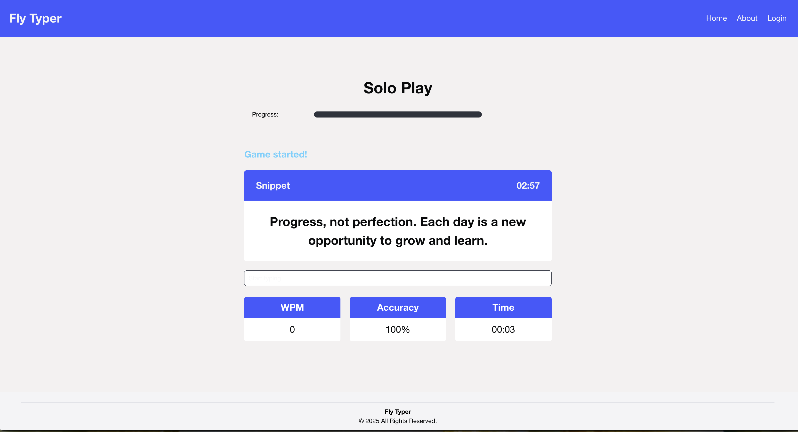
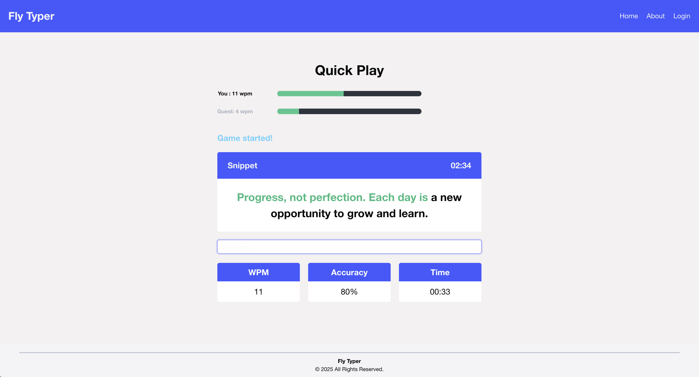

# Fly Typer

 Fly Typer is an interactive multiplayer game where you compete against real players in real-time, racing to see who can type the fastest and most accurately.


## Tech Stack

- Frontend: React, Vite, TypeScript, bulma

- Backend: Node.js, Express, Postgres, Sequelize

- Multiplayer functionality: Socket.io

- Testing: Vitest


## Getting started

- Install dependencies in the /client and /server folder.

- Use ```npm run dev``` in /client

- Use ```npm start``` in /server/src


## Authors

- [@eric-gebus](https://www.github.com/-eric-gebus)
- [@Guillermo-AA](https://github.com/Guillermo-AA)
- [@liya-mary](https://github.com/liya-mary)


## Screenshots






